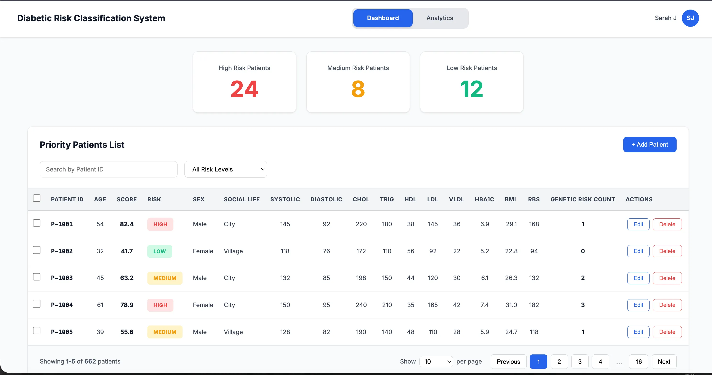

# Diabetic Risk Classification System



## Introduction

The **Diabetic Risk Classification System** is a web-based clinical decision support tool designed to help healthcare providers efficiently manage and prioritize diabetic patients based on their clinical risk factors. The system leverages the Random Forest classification to automatically assess patient health indicators and categorize them into risk levels (Low, Medium, High), enabling clinicians to identify high-priority cases and provide timely interventions.

By integrating automated risk scoring with an intuitive dashboard interface, the system streamlines patient management workflows and supports better health outcomes through data-driven prioritization.

## Tech Stack

### Frontend
- **React** - Component-based UI library for building interactive interfaces
- **HTML5/CSS3** - Markup and styling
- **Vite** - Fast build tool and development server

### Backend
- **Node.js** - JavaScript runtime environment
- **Express.js** - Web application framework for RESTful API development

### Database
- **MySQL** - Relational database for secure patient data storage

### Analytics & Machine Learning
- **Python** - Data analysis and machine learning model development
- **scikit-learn** - Machine learning library for model training (Random Forest classifier)
- **pandas/numpy** - Data manipulation and numerical computing

## Features

### Frontend Features
- **Interactive Dashboard** - Real-time overview of patient risk distribution with summary cards showing High, Medium, and Low-risk patient counts
- **Priority Patient List** - Sortable, searchable table displaying all patients ordered by risk score (highest risk first)
- **Patient Search** - Quick search functionality to find patients by Patient ID
- **Risk Filtering** - Filter patients by risk level for focused review
- **Data Entry Forms** - User-friendly forms for adding and editing patient records with validation

### Backend Features
- **RESTful API** - Endpoints for CRUD operations on patient data
- **Secure Authentication** - Login system for clinician access control
- **Data Validation** - Server-side validation ensuring data integrity and clinical reasonability
- **Real-time Risk Calculation** - Automatic risk score computation on data entry/modification
- **Multi-user Support** - Concurrent user access without performance degradation

### Machine Learning Features
- **Automated Risk Scoring** - ML-powered classification on a 0-100 scale
- **Random Forest Model** - Trained on historical patient data for accurate risk prediction
- **Multi-factor Analysis** - Evaluates 14+ clinical indicators including:
  - HbA1c (Glycated Hemoglobin)
  - BMI (Body Mass Index)
  - Blood Pressure (Systolic/Diastolic)
  - Cholesterol levels (Total, HDL, LDL, VLDL, Triglycerides)
  - Blood sugar levels (FBS, RBS)
  - Demographic factors (Age, Sex, Social Life)
  - Genetic Risk Count
- **Feature Importance Display** - Shows which clinical factors contribute most to each patient's risk score
- **Model Retraining Capability** - System designed to improve accuracy as more patient data is collected

## Quick Start

Follow these steps to set up the project locally on your machine.

### Prerequisites

Make sure you have the following installed on your machine:

- **Git** - Version control system
- **Node.js** (v14 or higher) - JavaScript runtime
- **npm** (Node Package Manager) - Comes with Node.js
- **MySQL** (v8.0 or higher) - Database server
- **Python** (v3.8 or higher) - For ML model training and analytics

### Cloning the Repository

```bash
git clone https://github.com/deshanekanayaka/diabetic-risk-classification-system
cd diabetic-risk-classification-system
```

### Frontend Setup

1. Navigate to the frontend directory:

```bash
cd frontend
```

2. Install frontend dependencies:

```bash
npm install
```

3. Create a `.env` file in the frontend root directory:

```bash
VITE_API_BASE_URL=http://localhost:3000/api
VITE_APP_NAME=Diabetic Risk Classification System
```

### Backend Setup

1. Navigate to the backend directory:

```bash
cd backend
```

2. Install backend dependencies:

```bash
npm install
```

3. Create a `.env` file in the backend root directory:

```bash
# Server Configuration
PORT=3000
NODE_ENV=development

# Database Configuration
DB_HOST=localhost
DB_USER=root
DB_PASSWORD=your_mysql_password
DB_NAME=diabetic_db
DB_PORT=3306

# Authentication
JWT_SECRET=your_jwt_secret_key_here
JWT_EXPIRE=24h

# Encryption
ENCRYPTION_KEY=your_encryption_key_here

# Python ML Service
PYTHON_SERVICE_URL=http://localhost:5000
```

### Database Setup

1. Log into MySQL:

```bash
mysql -u root -p
```

2. Create the database:

```sql
CREATE DATABASE diabetic_db;
USE diabetic_db;
```

3. Run the database schema script:

```bash
mysql -u root -p diabetic_db < backend/database/schema.sql
```

4. (Optional) Load sample data:

```bash
mysql -u root -p diabetic_db < backend/database/seed.sql
```

### Machine Learning Setup

1. Navigate to the ML directory:

```bash
cd machine-learning
```

2. Create a Python virtual environment:

```bash
python -m venv venv
source venv/bin/activate  # On Windows: venv\Scripts\activate
```

3. Install Python dependencies:

```bash
pip install -r requirements.txt
```

4. Train the initial model (if not already trained):

```bash
python train_model.py
```

### Running the Project

#### Start the Backend Server

```bash
cd backend
npm run dev
```

The backend server will start at `http://localhost:3000`

#### Start the ML Service

```bash
cd machine-learning
source venv/bin/activate  # On Windows: venv\Scripts\activate
uvicorn app:app --reload --port 5000
```

The ML service will start at `http://localhost:5000`

#### Start the Frontend Development Server

```bash
cd frontend
npm run dev
```

The frontend will start at `http://localhost:5173` (or the next available port)

Open `http://localhost:5173` in your browser to view the application.

### Building for Production

To create an optimized production build:

```bash
cd frontend
npm run build
```

The production-ready files will be in the `dist` directory.

## API Endpoints

**Base URL:** `http://localhost:3000`

### Authentication
- `POST /api/auth/login` - Clinician login
- `POST /api/auth/logout` - Logout

### Patients
- `GET /api/patients` - Get all patients (with filtering/sorting)
- `GET /api/patients/:id` - Get patient by ID
- `POST /api/patients` - Add new patient
- `PUT /api/patients/:id` - Update patient record
- `DELETE /api/patients/:id` - Delete patient

### Risk Analysis
- `POST /api/risk/calculate` - Calculate risk score for patient data
- `GET /api/risk/summary` - Get risk distribution summary

## Future Enhancements

- Integration with hospital Electronic Medical Record (EMR) systems
- Mobile application for on-the-go patient management
- AI-based diagnostic predictions and recommendations
- Automated notifications and reminders for follow-up appointments
- Advanced analytics dashboard with trend visualization
- Patient outcome tracking and model performance monitoring
- Export functionality for reports and analytics

## License

This project is licensed under the MIT License - see the LICENSE file for details.

---

**Note**: This is a prototype system designed for educational and demonstration purposes. For production deployment in clinical settings, additional regulatory compliance, security audits, and clinical validation are required.